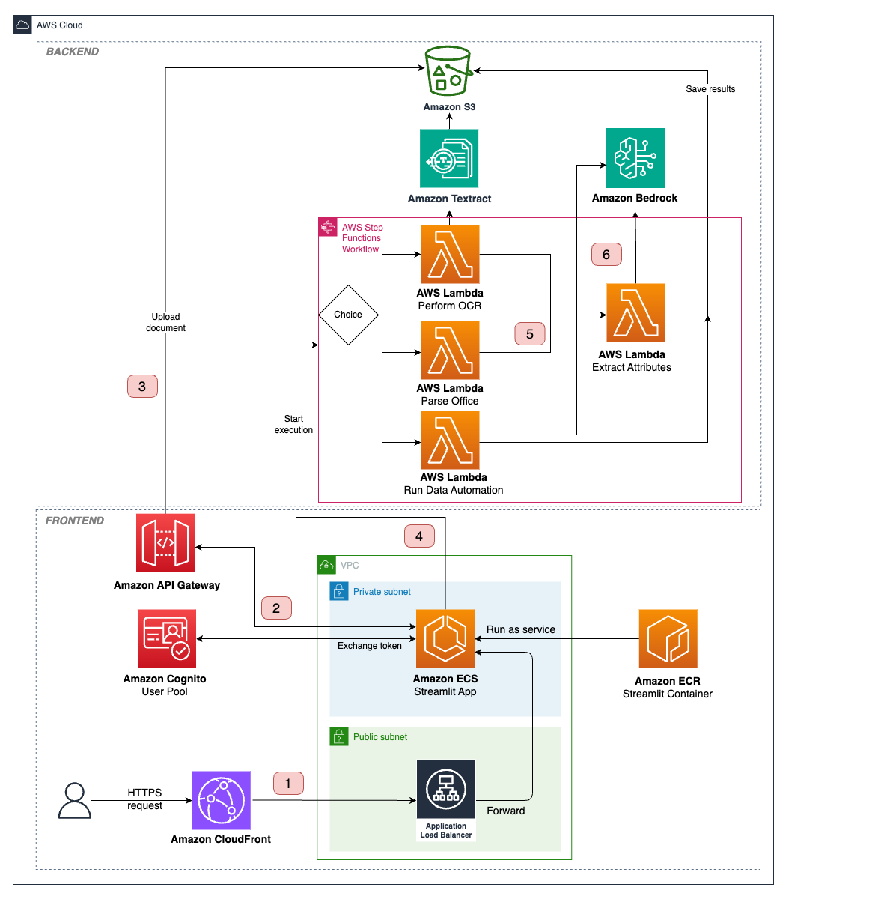

# Intelligent Document Processing with Generative AI

🚀 Extract information from unstructured documents at scale with Amazon Bedrock

🌎 Open-source asset published at [aws-samples GitHub](https://github.com/aws-samples/intelligent-document-processing-with-amazon-bedrock)


Converting documents into structured databases is a recurring business need. Common use cases include creating product feature tables from descriptions, extracting metadata from legal contracts, and analyzing customer reviews.

This repository provides an AWS CDK solution for intelligent document processing (IDP) using generative AI.

✨ **Key features:**
- Extract structured information:
  - Well-defined entities (names, titles, etc.)
  - Numeric scores (sentiment, urgency, etc.)
  - Free-form content (summaries, responses, etc.)
- Simply describe attributes to extract without data annotation or model training
- Leverage Amazon Bedrock Data Automation and multi-modal LLMs
- Process PDFs, MS Office files, images, and text via [Python API](demo/idp_bedrock_demo.ipynb) or [web interface](src/ecs/src/Home.py)
- Deploy as MCP server to equip AI agents with document processing capabilities

## Contents

- [📹 Demo](#demo)
- [🏗️ Architecture](#architecture)
- [🔧 Deployment](#deployment)
  - [1. Clone Repository](#1-clone-repository)
  - [2. Install Prerequisites](#2-install-prerequisites)
  - [3. Setup Environment](#3-setup-environment)
  - [4. Configure Stack](#4-configure-stack)
  - [5. Enable Bedrock Models](#5-enable-bedrock-models)
  - [6. Bootstrap CDK](#6-bootstrap-cdk)
  - [7. Deploy Stack](#7-deploy-stack)
- [💻 Usage](#usage)
  - [1. Python API](#1-python-api)
  - [2. Web Application](#2-web-application)
  - [3. MCP Integration](#3-mcp-integration)
- [👥 Team](#team)
- [🤝 Contributing](#contributing)
- [🔒️ Security](#security)
- [📝 License](#license)

## 📹 Demo

**API Example**

See the [demo notebook](demo/idp_bedrock_demo.ipynb) for complete implementation:

```python
docs = ['doc1', 'doc2']

features = [
    {"name": "delay", "description": "delay of the shipment in days"},
    {"name": "shipment_id", "description": "unique shipment identifier"},
    {"name": "summary", "description": "one-sentence summary of the doc"},
]

run_idp_bedrock_api(documents=docs, features=features)
# [{'delay': 2, 'shipment_id': '123890', 'summary': 'summary1'},
#  {'delay': 3, 'shipment_id': '678623', 'summary': 'summary2'}]
```

**Web Interface**

https://github.com/user-attachments/assets/cac8a6e1-2e70-4ca0-a9e7-d959619941f4

## 🏗️ Architecture



## 🔧 Deployment

Deploy to your AWS account using a local IDE or SageMaker Notebook instance.

**Recommendation:** Use SageMaker (`ml.t3.large`) to avoid local setup. Ensure the IAM role has CloudFormation deployment permissions.

### 1. Clone Repository

```bash
git clone https://github.com/aws-samples/intelligent-document-processing-with-amazon-bedrock.git
cd intelligent-document-processing-with-amazon-bedrock
```

### 2. Install Prerequisites

**SageMaker Notebook:**
```bash
sh install_deps.sh
```

**Local Development:**
Ensure you have:
- [AWS CLI](https://docs.aws.amazon.com/cli/latest/userguide/getting-started-install.html) with configured profile
- [Node.js](https://nodejs.org/en/download/package-manager)
- [AWS CDK Toolkit](https://docs.aws.amazon.com/cdk/v2/guide/cli.html)
- [Python 3.9+](https://www.python.org/downloads/)
- [uv](https://docs.astral.sh/uv/getting-started/installation/)
- [Docker Desktop](https://www.docker.com/products/docker-desktop/)

### 3. Setup Environment

```bash
sh install_env.sh
source .venv/bin/activate
```

### 4. Configure Stack

Copy `config-example.yml` to `config.yml` and customize the settings:

```yaml
stack_name: idp-test  # Stack name and resource prefix (<16 chars, no "aws" prefix)
# ... other settings
frontend:
  deploy_ecs: True  # Deploy web interface
```

Add your email to the Cognito users list in the `authentication` section.

### 5. Enable Bedrock Models

1. Open AWS Bedrock console in your target region
2. Navigate to "Model Access"
3. Request access for models specified in `config.yml`

### 6. Bootstrap CDK

```bash
cdk bootstrap --profile [PROFILE_NAME]
```

### 7. Deploy Stack

Ensure Docker is running, then:

```bash
cdk deploy --profile [PROFILE_NAME]
```

### Cleanup

```bash
cdk destroy --profile [PROFILE_NAME]
```

Or delete the CloudFormation stack from AWS console.

### Troubleshooting

**Permission Issues**
CDK deployment requires near-admin permissions. See [minimal required permissions](https://stackoverflow.com/a/61102280).

**S3 Bucket Deletion**
Empty the S3 bucket manually before stack deletion if it contains documents.

**Python Path Error**
If you see `/bin/sh: python3: command not found`, update the Python path in `cdk.json`.


## 💻 Usage

We offer three ways to interact with the IDP solution, including API calls, web application, and MCP server.

### 1. Python API

Follow the [demo notebook](api/idp_bedrock_demo.ipynb) to process documents programmatically:
- Provide input documents
- Define attributes to extract

### 2. Web Application

**Access:**
- URL appears in CDK deployment output as "CloudfrontDistributionName"
- Or find the CloudFront distribution domain in AWS console

**Login:**
- Username: Your email from `config.yml`
- Password: Temporary password sent to your email after deployment

**Local testing:**
```bash
cd src/ecs
# Set STACK_NAME in .env file
# Configure AWS credentials in .env or export AWS_PROFILE
uv venv && source .venv/bin/activate
uv sync --extra dev
streamlit run src/Home.py
```
Access the UI at [http://localhost:8501](http://localhost:8501)

### 3. MCP Integration

> **⚠️ SECURITY NOTICE**: The MCP server package is NOT available on PyPI. Only use the local installation methods described below. Any package named `idp-bedrock-mcp-server` on PyPI is not official and may be malicious.

Deploy MCP servers to expose document processing as standardized tools for AI agents.

**Two Options Available:**

**Local Stdio Server** (recommended for development)
- Supports local file upload
- Uses your AWS credentials
- Easy installation via local deployment script

```bash
cd mcp/local_server/
sh deploy_stdio_server.sh
```

**Bedrock AgentCore Server** (recommended for production)
- Remote hosted service
- Cognito authentication
- Scalable infrastructure

```bash
cd mcp/bedrock_server/
python deploy_idp_bedrock_mcp.py
```

**Available Tools:**
- `extract_document_attributes`: Process documents with custom attributes
- `get_extraction_status`: Check job status
- `list_supported_models`: Get available Bedrock models
- `get_bucket_info`: Get S3 bucket details

See detailed documentation:
- [Local Server](mcp/local_server/README.md)
- [Bedrock Server](mcp/bedrock_server/README.md)

## 👥 Team

**Core Team:**

|  |  |
|---|---|
| [Nikita Kozodoi](https://www.linkedin.com/in/kozodoi/) | [Nuno Castro](https://www.linkedin.com/in/nunoconstantinocastro/) |

**Contributors:**

|  |  |  |  |  |  |  |  |
|---|---|---|---|---|---|---|---|
| [Romain Besombes](https://www.linkedin.com/in/romainbesombes/) | [Zainab Afolabi](https://www.linkedin.com/in/zainabafolabi/) | [Egor Krasheninnikov](https://www.linkedin.com/in/egorkrash/) | [Huong Vu](https://www.linkedin.com/in/huong-vu/) | [Aiham Taleb](https://www.linkedin.com/in/aihamtaleb/) | [Elizaveta Zinovyeva](https://www.linkedin.com/in/zinov-liza/) | [Babs Khalidson](https://www.linkedin.com/in/babskhalidson/) | [Ennio Pastore](https://www.linkedin.com/in/enniopastore/) |

**Acknowledgements:**
- [Tan Takher](https://www.linkedin.com/in/tanrajbir/)
- [Ivan Sosnovik](https://www.linkedin.com/in/ivan-sosnovik/)

## 🤝 Contributing

We welcome contributions to improve this project!

In order to keep coding standards and formatting consistent, we use `pre-commit`. This can be run from the terminal via `uv run pre-commit run -a`.

See [CONTRIBUTING](CONTRIBUTING.md#security-issue-notifications) for more information.

## 🔒️ Security

Note: this asset represents a proof-of-value for the services included and is not intended as a production-ready solution. You must determine how the AWS Shared Responsibility applies to their specific use case and implement the needed controls to achieve their desired security outcomes. AWS offers a broad set of security tools and configurations to enable out customers.

- **Network & Delivery:**
  - Amazon CloudFront:
    - Use geography-aware rules to block or allow access to CloudFront distributions where required.
    - Use AWS WAF on public CloudFront distributions.
    - Ensure that solution CloudFront distributions use a security policy with minimum TLSv1.1 or TLSv1.2 and appropriate security ciphers for HTTPS viewer connections. Currently, the CloudFront distribution allows for SSLv3 or TLSv1 for HTTPS viewer connections and uses SSLv3 or TLSv1 for communication to the origin.
  - Amazon API Gateway:
    - Activate request validation on API Gateway endpoints to do first-pass input validation.
    - Use AWS WAF on public-facing API Gateway Endpoints.
- **AI & Data:**
  - Amazon Bedrock:
    - Enable model invocation logging and set alerts to ensure adherence to any responsible AI policies. Model invocation logging is disabled by default. See [Bedrock model invocation logging documentation](https://docs.aws.amazon.com/bedrock/latest/userguide/model-invocation-logging.html)
    - Consider enabling Bedrock Guardrails to add baseline protections against analyzing documents or extracting attributes covering certain protected topics; as well as detecting and masking PII data in the user-uploaded inputs.
  - Note that the solution is not scoped for processing regulated data.
- **Security & Compliance**:
  - Amazon Cognito:
    - Implement multi-factor authentication (MFA) in each Cognito User Pool.
    - Consider implementing AdvanceSecurityMode to ENFORCE in Cognito User Pools.
  - Amazon KMS:
    - Implement KMS key rotation for regulatory compliance or other specific cases.
    - Configure, monitor, and alert on KMS events according to lifecycle policies.
- **Serverless**:
  - AWS Lambda:
    - Periodically scan all AWS Lambda container images for vulnerabilities according to lifecycle policies. AWS Inspector can be used for that.

## 📝 License

Licensed under the MIT-0 License. See the LICENSE file.
