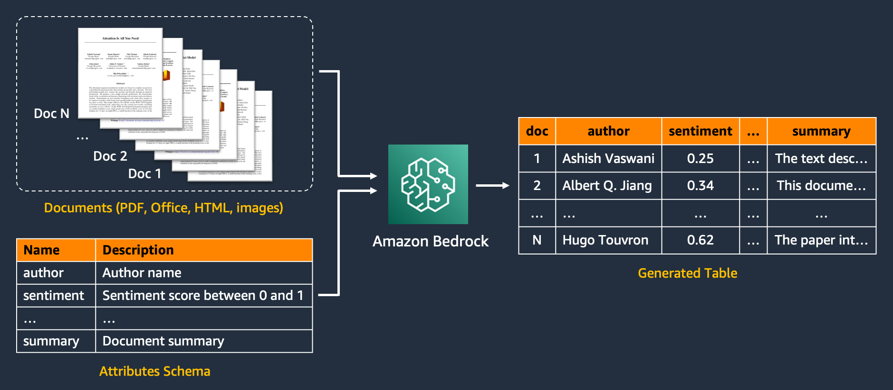
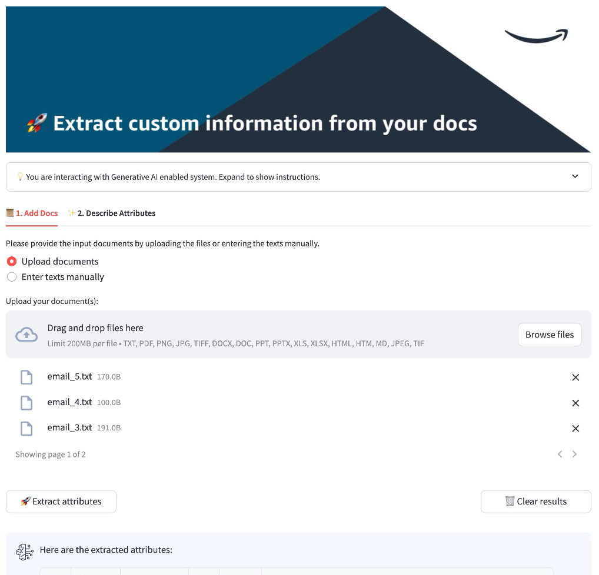
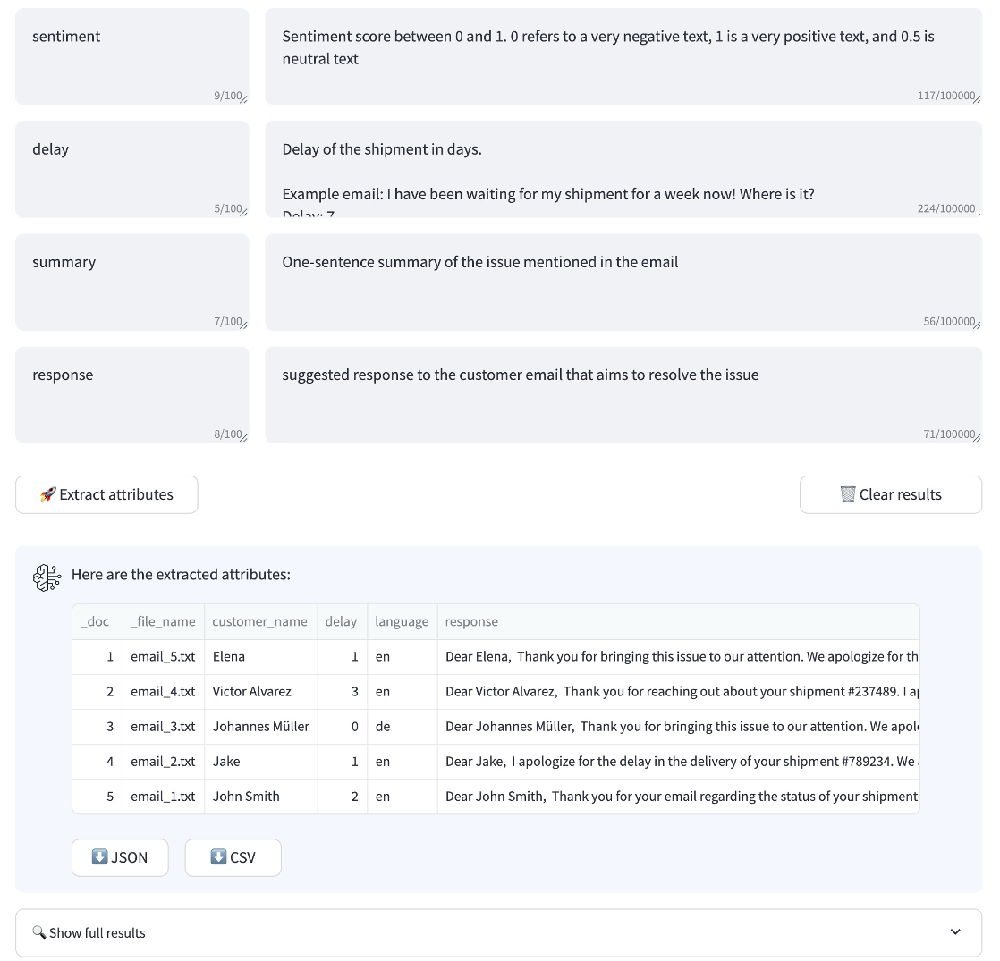

# Intelligent Document Processing with Generative AI

🚀 Extract information from unstructured documents at scale with Amazon Bedrock




## Contents

- [Overview](#overview)
- [Demo video](#demo)
- [Deploy the app](#deploy-the-app)
- [Use the app](#use-the-app)
- [Architecture](#architecture)
- [Team](#team)
- [Security](#security)
- [License](#license)


# 🔥 Overview

Converting documents into a structured database is a recurring business task. Common use cases include creating a product feature table from article descriptions, extracting meta-data from internal documents, analyzing customer reviews, and more.

This repo provides an AWS CDK solution that extracts information from documents in minutes using generative AI.

- Extract different information types, including:
  - Well-defined entities (e.g., name, title)
  - Numeric scores (e.g., sentiment, urgency)
  - Free-form content (e.g., summary, suggested response)
- Describe the attributes to be extracted from your docs without costly data annotation or model training
- Leverage Amazon Bedrock Data Automation, multi-modal LLMs on Amazon Bedrock, and/or Amazon Textract
- Use [Python API](demo/idp_bedrock_demo.ipynb) or [demo UI](assets/streamlit/src/Home.py) to process PDFs, MS Office, images, and get JSON output

# 📹 Demo

**Web UI Video**

📹 [Click here](screenshots/idp_demo.mp4) to watch a short demo of the app.

**Example API Call**

Refer to [the demo notebook](demo/idp_bedrock_demo.ipynb) for the API implementation and usage examples:

```python
docs = ['doc1', 'doc2']

features = [
    {"name": "delay", "description": "delay of the shipment in days"},
    {"name": "shipment_id", "description": "unique shipment identifier"},
    {"name": "summary", "description": "one-sentence summary of the doc"},
]

run_idp_bedrock_api(
    documents=docs,
    features=features,
)
# [{'delay': 2, 'shipment_id': '123890', 'summary': 'summary1'},
# {'delay': 3, 'shipment_id': '678623', 'summary': 'summary2'}]
```

**Example Web UI**

<p float="left">
  
  
</p>


# 🔧 Deploy the App

To deploy the app to your AWS account, you can use a local IDE or create a SageMaker Notebook instance.

We recommend using SageMaker to avoid installing extra requirements. Set up `ml.m5.large` instance and make sure the IAM role attached to the notebook has sufficient permissions for deploying CloudFormation stacks.

### 1. Clone the Repo

Clone the repo to a location of your choice:

```bash
git clone https://github.com/aws-samples/process-complex-documents-with-amazon-bedrock.git
```


### 2. Install Prerequisites

When working from a SageMaker Notebook instance, run this script to install all missing requirements:

```bash
cd <folder with the downloaded asset>
sh install_deps.sh
```

When working locally, make sure you have installed the following tools, languages as well as access to the target AWS account:

- [AWS CLI](https://docs.aws.amazon.com/cli/latest/userguide/getting-started-install.html)
- [AWS Account](https://docs.aws.amazon.com/cli/v1/userguide/cli-chap-configure.html): configure an AWS account with a profile `$ aws configure --profile [profile-name]`
- [Node.js](https://nodejs.org/en/download/package-manager)
- [IDE for your programming language](https://code.visualstudio.com/)
- [AWS CDK Toolkit](https://docs.aws.amazon.com/cdk/v2/guide/cli.html)
- [Python 3.9+](https://www.python.org/downloads/)
- [uv](https://docs.astral.sh/uv/getting-started/installation/) - Fast Python package installer and resolver
- [Docker Desktop](https://www.docker.com/products/docker-desktop/)


### 3. Activate the Environment

Navigate to the project folder and execute the following script to create a virtual environment on macOS or Linux and install dependencies using uv:

```bash
sh install_env.sh
source .venv/bin/activate
```

### 4. Configure the Stack

Copy the `config-example.yml` to a `config.yml` file and specify your project name and modules you would like to deploy (e.g., whether to deploy a UI).

```yaml
stack_name: idp-bedrock   # Name of your demo, will be used as stack name and prefix for resources

...

streamlit:
  deploy_streamlit: True
```


### 5. Configure Bedrock Model Access

- Open the target AWS account
- Open AWS Bedrock console and navigate to the region specified in `config.yml`
- Select "Model Access" in the left sidebar and browse through the list of available LLMs
- Make sure to request and enable access for the model IDs that are specified in  `config.yml`


### 6. CDK Bootstrap

Bootstrap CDK in your account. When working locally, use the profile name you have used in the `aws configure` step. When working from a SageMaker Notebook instance, profile specification is not required.

```bash
cdk bootstrap --profile [PROFILE_NAME]
```

Note: you can easily configure multiple accounts and bootstrap and deploy the framework to different accounts.


### 7. CDK Deploy

Make sure the Docker daemon is running in case you deploy the Streamlit frontend. On Mac, you can just open Docker Desktop. On SageMaker, Docker daemon is already running.

```bash
cdk deploy --profile [PROFILE_NAME]
```

Note: if you encounter `/bin/sh: python3: command not found`, change `python3` in `cdk.json` to your Python alias.


### Clean up

You can delete the CDK stack from your AWS account by running:

```bash
cdk destroy --profile [AWS_PROFILE_NAME]
```

or manually deleting the CloudFormation from the AWS console.


### Common Issues

#### Permissions to run CDK deploy

Deploying CDK / CloudFormation stacks requires near Admin Permissions. Make sure to have the necessary IAM account permissions before running CDK deploy. Here is a detailed list of [minimal required permissions](https://stackoverflow.com/a/61102280) to deploy a stack.

#### Empty S3 before deleting the stack

When deleting the stack, it may delete everything except for the created S3 bucket, which will contain the uploaded documents by the user and their processed versions. In order to actually delete this s3 bucket, you may need to empty it first. This is an expected behavior as all s3 buckets may contain sensitive data to the users.


# 💻 Use the App

## Option 1: Run API with Python

Follow steps in this [notebook](demo/idp_bedrock_demo.ipynb) to run a job via an API call. You will need to:
- provide input document text(s)
- provide a list of features to be extracted

## Option 2: Run web app

### Add Cognito Users

From the console:
- Open the Amazon Cognito Console in the AWS console
- Choose the created user pool, navigate to users, and click "create user"
- Provide the user name and a temporary password or email address for auto-generated password
    - Users will be able to log into the frontend using Cognito credentials

As part of the code:
- Add a list of Cognito user emails in `config.yml` in the authentication section
- Each of the users will receive a temporary password from no-reply@verificationemail.com

### Access the Frontend

- The URL to access the frontend appears as output at the end of the CDK deployment under "CloudfrontDistributionName"

or

- Open the AWS console, and go to CloudFront
- Copy the Domain name of the created distribution

#### Local Testing

You can run the Streamlit frontend locally for testing and development by following these steps:

- Deploy the CDK stack once
- Go to ```assets/streamlit/.env``` and set ```STACK_NAME``` to your stack name in the `config.yml`
- Provide AWS credentials
  - You can add AWS credentials to the ```assets/streamlit/.env``` file
  - Or simply export credentials in your terminal, e.g. ```export AWS_PROFILE=<profile>```
- Navigate to the frontend folder, create environment and install dependencies:
```bash
cd assets/streamlit
uv venv
source .venv/bin/activate
uv sync --extra dev
```
- Start frontend on localhost: ```streamlit run src/Home.py```
- Copy the local URL from the terminal output and paste in the address bar of your browser
- Make sure that the local URL you use is http://localhost:8501. It will not work otherwise

In order to keep coding standards and formatting consistent, we use `pre-commit`. This can be run from the terminal via `uv run pre-commit run -a`.

# 🏗️ Architecture

The following diagram illustrates the high-level architecture of this solution:


# 👥 Team

**Core team:**

|  |  |
|---|---|
| [Nikita Kozodoi](https://www.linkedin.com/in/kozodoi/) | [Nuno Castro](https://www.linkedin.com/in/nunoconstantinocastro/) |

**Contributors:**

|  |  |  |  |  |  |  |  |
|---|---|---|---|---|---|---|---|
| [Romain Besombes](https://www.linkedin.com/in/romainbesombes/) | [Zainab Afolabi](https://www.linkedin.com/in/zainabafolabi/) | [Egor Krasheninnikov](https://www.linkedin.com/in/egorkrash/) | [Huong Vu](https://www.linkedin.com/in/huong-vu/) | [Aiham Taleb](https://www.linkedin.com/in/aihamtaleb/) | [Elizaveta Zinovyeva](https://www.linkedin.com/in/zinov-liza/) | [Babs Khalidson](https://www.linkedin.com/in/babskhalidson/) | [Ennio Pastore](https://www.linkedin.com/in/enniopastore/) |

**Acknowledgements:**

- [Tan Takher](https://www.linkedin.com/in/tanrajbir/)
- [Ivan Sosnovik](https://www.linkedin.com/in/ivan-sosnovik/)


## 🔒️ Security

See [CONTRIBUTING](CONTRIBUTING.md#security-issue-notifications) for more information.

Note: this asset represents a proof-of-value for the services included and is not intended as a production-ready solution. You must determine how the AWS Shared Responsibility applies to their specific use case and implement the needed controls to achieve their desired security outcomes. AWS offers a broad set of security tools and configurations to enable out customers.

- **Input data:**
  - Note that the solution is not scoped for processing regulated data.
- **Network & Delivery:**
  - CloudFront:
    - Use geography-aware rules to block or allow access to CloudFront distributions where required.
    - Use AWS WAF on public CloudFront distributions.
    - Ensure that solution CloudFront distributions use a security policy with minimum TLSv1.1 or TLSv1.2 and appropriate security ciphers for HTTPS viewer connections. Currently, the CloudFront distribution allows for SSLv3 or TLSv1 for HTTPS viewer connections and uses SSLv3 or TLSv1 for communication to the origin.
  - API Gateway:
    - Activate request validation on API Gateway endpoints to do first-pass input validation.
    - Use AWS WAF on public-facing API Gateway Endpoints.
- **Machine Learning and AI:**
  - Bedrock
    - Enable model invocation logging and set alerts to ensure adherence to any responsible AI policies. Model invocation logging is disabled by default. See https://docs.aws.amazon.com/bedrock/latest/userguide/model-invocation-logging.html
    - Consider enabling Bedrock Guardrails to add baseline protections against analyzing documents or extracting attributes covering certain protected topics.
  - Comprehend
    - Consider using Amazon COmprehend for detecting and masking PII data in the user-uploaded inputs.
- **Security & Compliance**:
  - Cognito
    - Implement multi-factor authentication (MFA) in each Cognito User Pool.
    - Consider implementing AdvanceSecurityMode to ENFORCE in Cognito User Pools.
  - KMS
    - Implement KMS key rotation for regulatory compliance or other specific cases.
    - Configure, monitor, and alert on KMS events according to lifecycle policies.
- **Serverless**:
  - Lambda
    - Periodically scan all AWS Lambda container images for vulnerabilities according to lifecycle policies. AWS Inspector can be used for that.


## 📝 License

This library is licensed under the MIT-0 License. See the LICENSE file.
