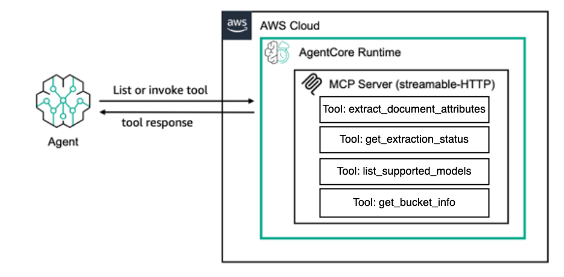

# IDP with Amazon Bedrock MCP Server

This directory contains the Model Context Protocol (MCP) AgentCore server implementation for the IDP (Intelligent Document Processing) with Amazon Bedrock project.

## Overview

The MCP server provides a standardized interface for document processing capabilities, allowing AI assistants and other clients to interact with the IDP system through the Model Context Protocol.



## Features

- **Document Attribute Extraction**: Extract structured attributes from various document types
- **Multi-format Support**: Process PDFs, images, text files, and office documents
- **Amazon Bedrock Integration**: Leverage powerful LLMs for intelligent document analysis
- **S3 Integration**: Seamless document storage and retrieval
- **Status Tracking**: Monitor extraction job progress and results

## Quick Start

### Prerequisites

Before deploying the MCP server, ensure you have:
1. **Successfully deployed the main IDP stack** using the root project deployment
2. **Verified that all infrastructure is working** (Step Functions, S3, Cognito, Lambda functions)
3. **Docker running** on your local machine
4. **Cognito user configured** in your `config.yml`

### Deploying the MCP Server

Deploy the MCP server to Amazon Bedrock AgentCore Runtime:

**Option A: Using the deployment script:**
```bash
python deploy_idp_bedrock_mcp.py
```

**Option B: Using the deployment notebook:**
```bash
jupyter notebook deploy_idp_bedrock_mcp.ipynb
```

### Generated Configuration Files

After successful deployment, you'll find configuration files in the `configs/` directory:

- **`configs/cline_agentcore_config.json`** - HTTP configuration for Cline
- **`configs/mcp_manual_config.json`** - Manual configuration details

### Cline Integration

Add the generated configuration to your Cline MCP settings:

```json
{
  "mcpServers": {
    "idp-bedrock-agentcore": {
      "disabled": false,
      "timeout": 30000,
      "type": "streamableHttp",
      "autoApprove": [
        "list_supported_models",
        "extract_document_attributes",
        "get_bucket_info"
      ],
      "url": "https://bedrock-agentcore.us-east-1.amazonaws.com/runtimes/...",
      "headers": {
        "Authorization": "Bearer ...",
        "Content-Type": "application/json",
        "Accept": "application/json, text/event-stream"
      },
      "debug": true
    }
  }
}
```

**Note**: This is a **streamableHttp** configuration for remote AgentCore access. For local development with file upload capabilities, use the separate local server in `mcp/local_server/`.

### Testing the MCP Server

After deployment, test the MCP server using the comprehensive test suite:

```bash
cd mcp/bedrock_server

# Run basic tests (recommended)
python test_mcp_server.py

# Run full test suite including document extraction
python test_mcp_server.py --full

# Run only document extraction test
python test_mcp_server.py --extraction-only
```

### Using Pytest

For development and CI/CD integration:

```bash
cd mcp/bedrock_server

# Run all working tests
python -m pytest tests/ -v

# Run specific test files
python -m pytest tests/test_simple.py -v
python -m pytest tests/test_direct_http.py -v
```

## MCP Tools Available

The server provides the following MCP tools:

### 1. `extract_document_attributes`
Extract structured attributes from documents using Amazon Bedrock LLMs.

**Parameters:**
- `documents`: List of document paths - supports multiple input types:
  - S3 keys: `["originals/email_1.txt", "uploaded/document.pdf"]`
  - S3 URIs: `["s3://my-bucket/documents/file.pdf", "s3://external-bucket/doc.txt"]`
  - Presigned URLs: `["https://bucket.s3.amazonaws.com/file.pdf?X-Amz-Signature=..."]`
- `attributes`: List of attribute definitions to extract
- `parsing_mode`: Processing mode (default: "Amazon Bedrock LLM")
- `model_params`: LLM configuration (model_id, temperature, etc.)

**Supported Input Types:**
- **S3 keys**: Used directly if in the configured bucket
- **S3 URIs**: Files copied from external buckets if needed
- **Presigned URLs**: Files downloaded and uploaded to our bucket

**Example:**
```json
{
  "documents": ["originals/email_1.txt", "s3://external-bucket/invoice.pdf"],
  "attributes": [
    {"name": "sender_name", "description": "name of the person who sent the email"},
    {"name": "sentiment", "description": "overall sentiment of the email"}
  ],
  "parsing_mode": "Amazon Bedrock LLM",
  "model_params": {
    "model_id": "us.anthropic.claude-3-haiku-20240307-v1:0",
    "temperature": 0.1
  }
}
```

### 2. `get_extraction_status`
Check the status of a document extraction job.

**Parameters:**
- `execution_arn`: The Step Functions execution ARN to check

### 3. `list_supported_models`
Get a list of available Amazon Bedrock models for document processing.

**Parameters:** None

**Returns:**
- List of supported model IDs
- Default model information
- Model recommendations for speed vs quality

### 4. `get_bucket_info`
Get information about the S3 bucket used for document storage.

**Parameters:** None

**Returns:**
- S3 bucket name
- Supported file formats
- Usage instructions

## Architecture

The MCP server is deployed as an AWS Bedrock AgentCore Runtime, providing:

- **Scalable Processing**: Automatic scaling based on demand
- **Secure Access**: AWS IAM-based authentication and authorization
- **High Availability**: Multi-AZ deployment with automatic failover
- **Cost Optimization**: Pay-per-use pricing model

## Configuration

The server configuration is managed through AWS Systems Manager Parameter Store and AWS Secrets Manager:

- **Agent ARN**: `/idp-bedrock-mcp/runtime/agent_arn`
- **Credentials**: `idp-bedrock-mcp/cognito/credentials`

## Development

### Project Structure

```
mcp/bedrock_server/
├── test_mcp_server.py          # Comprehensive test suite
├── mcp_server.py               # Main MCP server implementation
├── utils.py                    # Utility functions
├── deploy_idp_bedrock_mcp.py   # Deployment script
├── update_mcp_config.sh        # Update MCP bearer token (shell script)
└── tests/                      # Additional test files
    ├── test_simple.py          # Basic connectivity tests
    ├── test_direct_http.py     # Direct HTTP tests
    └── test_helpers.py         # Test utilities
```

### Updating Bearer Token

Bearer tokens expire periodically and need to be refreshed. Use the provided script to automatically update your MCP client configuration:

**Shell Script Usage:**
```bash
# Update bearer token automatically (uses default config path)
./update_mcp_config.sh

# Test what would be updated without making changes (dry run)
./update_mcp_config.sh --dry-run

# Use custom MCP config path
./update_mcp_config.sh --config-path /path/to/your/mcp_settings.json

# Show help and usage information
./update_mcp_config.sh --help
```

**What the script does:**
- ✅ Fetches the latest bearer token from AWS Secrets Manager
- ✅ Automatically locates your MCP client settings file
- ✅ Updates the `idp-bedrock` server configuration
- ✅ Creates a backup of your config before making changes
- ✅ Preserves all other settings unchanged

**Note:** You may need to restart your MCP client for the token changes to take effect.


## License

This project is licensed under the MIT License - see the LICENSE file for details.
